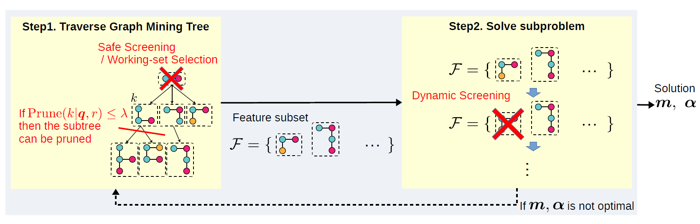

# Learning Interpretable Metric between Graphs
Source code for KDD2019 accepted paper "[Learning Interpretable Metric between Graphs: Convex Formulation and Computation with Graph Mining](https://www.kdd.org/kdd2019/accepted-papers/view/learning-interpretable-metric-between-graphs-convex-formulation-and-computa)"

## Abstract
<div align="center">
    
</div>

Graph is a standard approach to modeling structured data. Although many machine learning methods depend on the metric of the input objects, defining an appropriate distance function on graph is still a controversial issue. We propose a novel supervised metric learning method for a subgraph-based distance, called interpretable graph metric learning (IGML). IGML optimizes the distance function in such a way that a small number of important subgraphs can be adaptively selected. This optimization is computationally intractable with naive application of existing optimization algorithms. We construct a graph mining based efficient algorithm to deal with this computational difficulty. Important advantages of our method are 1) guarantee of the optimality from the convex formulation, and 2) high interpretability of results. To our knowledge, none of the existing studies provide an interpretable subgraph-based metric in a supervised manner. In our experiments, we empirically verify superior or comparable prediction performance of IGML to other existing graph classification methods which do not have clear interpretability. Further, we demonstrate usefulness of IGML through some illustrative examples of extracted subgraphs and an example of data analysis on the learned metric space.

## Programs
<div align="center">
    
</div>

There are five programs as follows:
- `SS&SP`: Perform safe screening and Safe Pruning. 
- `RSS&RSP`: Perform range-based SS and SP. 
- `WS&WP`: Perform working-set selection and pruning. 
- `RSS&RSP+WS&WP`: Perform both RSS&RSP and WS&WP. 
- `RSS&RSP+WS&WP+FullMetric`: Containing post-processing, in which learning Maharanobis distance. 

Each directory has `Makefile`.
Type `make`, and compile will begin. 

`RSS&RSP+WS&WP+FullMetric` program needs C++ [Eigen](http://eigen.tuxfamily.org/index.php?title=Main_Page) library. 
You must change `INCLUDE` variable in `Makefile` as follows:
```
INCLUDE  =  -I[your Eigen library path]
```


Containing `tree.hh` was obtained from http://tree.phi-sci.com/. 

A part of source code in graph mining is based on [gBoost](https://sites.cs.ucsb.edu/~xyan/software/gSpan.htm). 

### Usage
```
./run srand filename maxpat
```

- **srand**: Seed of random. 
- **filename**: Dataset name. 
- **maxpat**: Max pattern size. 

### Example
```
./run 1 AIDS 15
```

### Comment
Because the kernel matrix has a large capacity, 
the neighborhood of the sample is chosen at random unlike the paper. 
